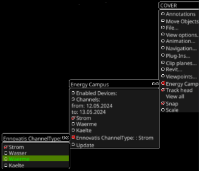

# EnergyCampus

This plugin is for prototyping VR tools for the ongoing project [SRI-DiTEnS](https://www.ditens.de/) using the example of the campus of the [University of Stuttgart](https://www.uni-stuttgart.de/). It will be later on updated to a plugin for a general use.

The main purpose of this plugin is to visualize geo data in VR from different sources (state offices (e.g. [LGL])(https://www.lgl-bw.de/), tileservers (e.g [GoogleMaps](https://www.google.de/maps), [OpenStreetmap](https://www.openstreetmap.de/))) and embedding it into a digital twin. Alongside the process to simplify the building of an urban twin, energy simulation and realtime data of the energy systems of the campus can be visualized in a variety of forms. Additionally different concepts for supporting stakeholder in the decisionmaking process for the discursive transformation process of energy systems are implemented as well. The project is funded by Carl-Zeis-Stiftung[^1]

## Requirements

- [nlohman::json](https://github.com/nlohmann/json)
- [GDAL](https://github.com/OSGeo/gdal)
- [PROJ](https://github.com/OSGeo/PROJ) currently only working with PROJ4 => will be updated soon to current versions
- CURL standard shipped in unix systems are enough
- Compiler supporting std c++17

Since its a plugin for OpenCOVER you will need to compile COVER first. Please follow the instructions in the README.md in the root folder of this github repository to compile and install OpenCOVER on your system.

The plugin will be automatically compiled and installed if all requirements are found by CMake.

## Software Design

The main plugin is a singleton instance of the class EnergyPlugin in energy.cpp/.h and contains the buisnesslogic to access databases and to initialise all different objects of the scene by fetching general information from the config file ***<root-repo>/config/plugin/EnergyCampus.toml***.

The current core of the plugin is using the interface pattern to simplify the process of exchanging different visualisiation objects more easy without the need of adjustment in the client code itself. Additionaly it is used to classify these objects for later interactions in the VR scene. For example for filtering all moveable objects in the scene you could use a function which accepts only objects from classes which implemented the interface IMoveable. A superior function can iterate through the objects in the scene and could call a function like:

```c++
void move(const IMoveable &moveable)
{
    // move this object
}
```
Example usage for using the interfaces can be seen in the code ***<root-of-this-plugin>/core/PrototypeBuilding.cpp*** and ***<root-of-this-plugin>/core/TxtInfoboard.cpp*** representing buildings and a billboard. For a general overview of available interfaces look at the next figure.


At the current state the plugin is using a REST based API from a software called Ennovatis to access the energy consumption of different buildings for different periods of time. The main logic for that is located in ***<root-of-this-plugin>/ennovatis***. Data from ennovatis is only accessible through a valid university account and a vpn tunnel to the university network.

To visualize historical energy data a simple interface is provided in the main class ***EnergyPlugin*** to access .csv files.

### Ennovatis

The code for the Ennovatis access is gatherd in the object library ***Ennovatis***. This library contains a json interface which uses the nlohmann::json::json_sax_t interface to parse json files (***ennovatis/sax.cpp/.h***). In this plugin it is used to parse the necessary channel id's for the Ennovatis devices located in a local json file to an internal vector for requesting ennovatis data via REST. Afterwards this vector is used in the Energyplugin to create ***EnnovatisDeviceSensor***-objects which holding ***EnnovatisDevice***-objects representing devices for each building setup in the Ennovatis database itself. This ***EnnovatisDeviceSensors*** are simple ***coPickSensors*** which represents clickable objects in the VR Scene. All necessary attributes for requesting data like name of each building instance, channel id's and so on are stored in a building object (***ennovatis/building.cpp/.h***) representing a building and more specific in an attached vector of channel objects (***ennovatis/channel.h***) symbolizing the channels of the building. So after clicking on an object in the scene an event will be triggered which uses the REST interface of the object library to fetch data from the Ennovatis servers (***ennovatis/rest.cpp/.h***) via threads in the background (***utils/ThreadWorker.h***). After getting the json response from the server the plugin uses the json interface (***ennovatis/json.cpp/.h***) of the object library ***Ennovatis*** to parse the result into a internal struct object called ***json_response_object*** for easy access of the data internally. The plugin will then update each drawable object representing the building itself by updating an ***IBuilding***-object. The drawable to show more detailed information from the Ennovatis response will be updated via the interface ***IInfoboard*** as well.

Current representation of buildings: cylinders (***core/PrototypeBuilding.cpp/.h***)

Current info representation: billboards (***core/TxtInfoboard.cpp/.h***)

### Database

tbd

## How to use the plugin

- setup vpn tunnel to the network of the university of stuttgart
- make sure the correct paths to the channel id json and historical data files are set in the config file ***config/plugin/EnergyCampus.toml***
- launch opencover via console

```bash
opencover opencover://plugin/EnergyCampus
```

or 

open opencover in your prefered way along with a tabletUI e.g.

```bash
opencover
tabletUI
```

and navigate in the tabletUI to the ***Plugin***-tab and enable the plugin manually by clicking on the button ***EnergyCampus***.

If done correct the plugin will add a new tab called ***EnergyCampus*** to the tabletUI and visualizing the historical data first.

If you want to switch to the Ennovatis implementation simply click in the VR menu on ***EnergyCampus*** and select a channel type by selecting an ***Ennovatis Channeltype*** like shown in the next picture



## TODO's

[ ] fetch latitude and longitude data from tile-server like googlemaps or openstreetmap
[ ] add new buildings for CityGML
[ ] implementing concepts for decisionmaking process

[^1]: [Carl-Zeis-Stiftung](https://www.carl-zeiss-stiftung.de/)